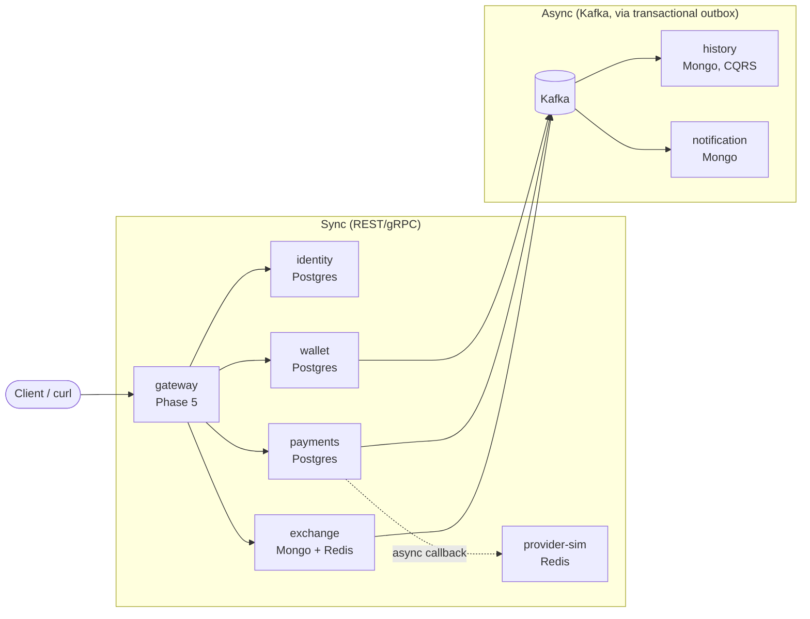

# Coinly

Coinly is a digital wallet & payments platform — a Wise/Revolut-style
core built as a set of Go microservices to demonstrate senior-level
backend engineering: hexagonal architecture, a double-entry ledger,
sagas, event-driven design, and the operational tooling (CI/CD, Docker,
Kubernetes, observability) around them.

**Status:** early — Phase 1 (identity + wallet foundation) is in
progress. See [docs/PLAN.md](docs/PLAN.md) for the full phased roadmap
and status checklist.

## What it does (target end state)

- Register users, issue JWTs, verify them locally via cached JWKS — no
  synchronous auth calls between services.
- Multi-currency wallets with a **double-entry ledger**: every balance
  change is an immutable, zero-sum journal entry.
- **P2P transfers** (one atomic transaction — not a saga; the reasoning is
  in [docs/PLAN.md](docs/PLAN.md#saga-decisions-adr-worthy), with an ADR
  to follow) and an **orchestrated withdrawal saga** against a simulated
  payment provider.
- **Currency exchange** via signed, TTL-bound rate quotes posted as one
  atomic multi-currency journal.
- A Kafka-driven, Mongo-backed **CQRS read model** for transaction
  history, rebuildable by replaying events from the beginning.
- Idempotent mutation endpoints (`Idempotency-Key`), so a retried request
  is safe and returns the original result rather than double-processing.

## Architecture



Commands are synchronous (REST at the edge, gRPC service-to-service);
facts are asynchronous (domain events over Kafka, always published via a
transactional outbox — never a direct dual-write). Full service
responsibilities and data-ownership rationale are in
[docs/PLAN.md](docs/PLAN.md#target-architecture-end-state); individual
design decisions are recorded as ADRs in [docs/adr/](docs/adr/).

## Tech stack

Go · REST · gRPC · PostgreSQL · MongoDB · Kafka · Redis · Docker ·
Kubernetes · GitHub Actions · Makefile · golangci-lint · buf (protobuf)

## Repo layout

```
coinly/
├── Makefile  go.work  .golangci.yml
├── .github/workflows/ci.yml
├── docs/adr/          # architecture decision records
├── proto/             # buf-managed protobuf contracts (Phase 1 step 3+)
├── gen/go/            # buf-generated Go code (own module)
├── pkg/                # shared infra-only code: money, ids, httpx, grpcx, pgx
├── services/           # one Go module per service (identity, wallet, ...)
└── deploy/compose/     # docker-compose dev stack
```

Each service follows a hexagonal layout (`internal/domain` → `internal/app`
→ `internal/adapters` → `cmd`), enforced by `depguard` in
[.golangci.yml](.golangci.yml). See [docs/PLAN.md](docs/PLAN.md) for the
full layout and the anti-distributed-monolith rules it encodes.

## Development

```bash
make help    # list all targets
make lint    # golangci-lint, via a pinned Docker image
make test    # go test -race -cover across all modules
make ci      # what CI runs: lint + test
```

`make up` (docker-compose dev stack) and the demo walkthrough land at the
end of Phase 1 — see the Status checklist in
[docs/PLAN.md](docs/PLAN.md#status).

## Documentation

- [docs/PLAN.md](docs/PLAN.md) — phased roadmap, status, and per-phase log
- [docs/adr/](docs/adr/) — architecture decision records
